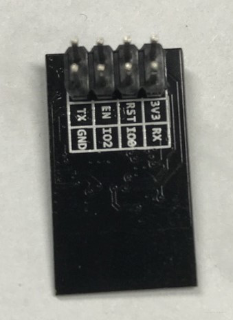

# STM32F103C8T6-BLUEPILL
### ST-LINK V2调试器

| ST-LINK | BLUEPILL |
| ------- | -------- |
| SWCLK   | CLK      |
| SWDIO   | DIO      |
| GND     | GND      |
| 3.3V    | 3.3V     |

### FT232 USB转串口

| FT232   | BLUEPILL |
| ------- | -------- |
| 白线-RX | Tx-A9    |
| 蓝线-TX | RX-A10   |
| GND     | GND      |

### SSD1306 OLED

| SSD1306 | BLUEPILL |
| ------- | -------- |
| Vcc     | 3.3      |
| GND     | GND      |
| SCL     | PB8      |
| SDA     | PB9      |

### HR-SR04超声波模块

| HR-SR04 | BLUEPILL |
| ------- | -------- |
| Vcc     | 5V       |
| Trig    | A0       |
| Echo    | A4       |
| GND     | GND      |

### MQ2烟雾传感器

| MQ2  | BLUEPILL |
| ---- | -------- |
| Vcc  | 3.3      |
| AOUT | A6       |
| DOUT | A7       |
| GND  | GND      |

### ESP8266-01S WIFI模块

| ESP8266  | BLUEPILL |
| -------- | -------- |
| VCC      | 3.3      |
| CH_PD/EN | 3.3      |
| TX       | A3       |
| RX       | A2       |
| RST      |          |
| GND      | GND      |

